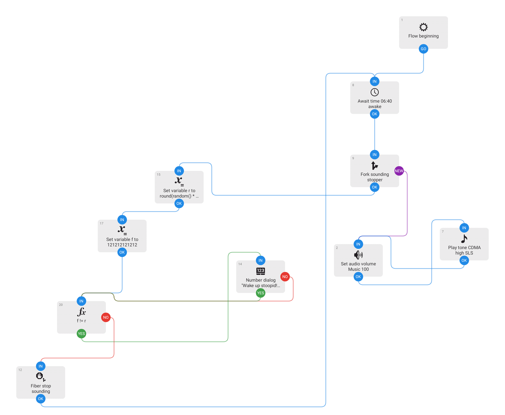

# wakethefuckup

An Automate flow to handle my stoopid brain

---

## So, essentially, here is the story

The last school year at my school just started and I have good will to do well and arrive at uni prepared.

The first day goes well, I  have my tablet and my good ol' repo [notesArchive](https:/github.com/MatMasit/notesArchive) and I take notes fastly and accurately.

The next day I wake up: I am late and I arrive school late by 10 min, racing on my bike, I had forgot to set my alarm on repeat and a friend of mine waited for me outside before going on his own.

I set my alarm again for today but I have woken up very late and I had not heard it despite it sounding; I arrive 30 minutes late this time, my friend waited for me again.

I am angry, very angry at myself, I don't even have the code to auth with the school app and justify the events.

So i open automate and make this flow.

## What does this do?

Essentially you import the flow in [Automate](https://llamalab.com/automate/) (Android app, you can use a tablet or whatever) and edit the time to your needs.

You can connect the audio jack to a surround system or whatever

When the time arrives, the most obnoxious sound is produced at full volume and you WILL wake up, walk to the tablet, unlock it and input a numbeer displayed on screen.

Essentially a very obnoxious alarm

## Is this viable as a normal alarm?

Only if you are alone at home and prepared to bear it, but the joy of being on time should help it
